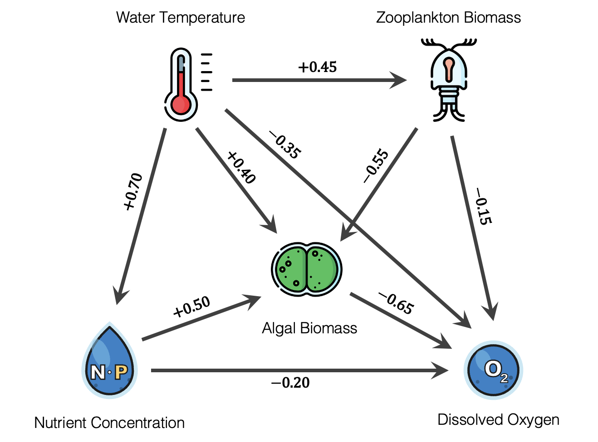

```{r setup, include = FALSE}
library(learnr)
library(gradethis)
library(tidyverse)
library(dagitty)
library(MuMIn)
library(broom)

theme_set(theme_light(base_size = 13))
options(na.action = "na.fail")  # required for dredge()

gradethis_setup()
knitr::opts_chunk$set(echo = FALSE)

# Helper: extract rounded coefficient 
est <- function(mod, term) {
  broom::tidy(mod) |>
    dplyr::filter(term == !!term) |>
    dplyr::pull(estimate) |>
    round(2)
}
```

```{r setup_data, include = FALSE}
# Simulate lake data ----
set.seed(1234)
n <- 300

water_temp      <- rnorm(n)
nutrient_conc   <- 0.70 * water_temp + rnorm(n, sd = sqrt(1 - 0.70^2))
zoo_biomass     <- 0.45 * water_temp + rnorm(n, sd = sqrt(1 - 0.45^2))
algal_biomass   <- 0.50 * nutrient_conc + 0.40 * water_temp - 0.55 * zoo_biomass +
                   rnorm(n, sd = 0.50)
dissolved_oxygen <- -0.65 * algal_biomass - 0.20 * nutrient_conc -
                    0.35 * water_temp - 0.15 * zoo_biomass + rnorm(n, sd = 0.40)

lake <- tibble(water_temp, nutrient_conc, zoo_biomass, algal_biomass, dissolved_oxygen)

# Minimum adjustment sets for each model
mod_zb_ab <- lm(algal_biomass ~ zoo_biomass  + water_temp, data = lake)
mod_nc_ab <- lm(algal_biomass ~ nutrient_conc + water_temp, data = lake)
mod_wt_ab <- lm(algal_biomass ~ water_temp, data = lake)
mod_ab_do <- lm(dissolved_oxygen ~ algal_biomass + water_temp + nutrient_conc + zoo_biomass,
                 data = lake)
# AIC ----
# With dissolved oxygen
mod_full  <- lm(algal_biomass ~ zoo_biomass + nutrient_conc + water_temp +
                      dissolved_oxygen, data = lake)
aic_full   <- dredge(mod_full)

# Best-supported AIC model without water_temp (when DO is included)
mod_aic_no_wt <- lm(algal_biomass ~ zoo_biomass + nutrient_conc + dissolved_oxygen,
                    data = lake)

# Without dissolved oxygen
mod_nodo <- lm(algal_biomass ~ zoo_biomass + nutrient_conc + water_temp, data = lake)
nodo_aic <-  dredge(mod_nodo)
```

```{r setup_dag, include = FALSE}
dag_algae <- dagitty('dag {
  "Water Temperature"    -> "Nutrient Concentration"
  "Water Temperature"    -> "Zooplankton Biomass"
  "Water Temperature"    -> "Algal Biomass"
  "Water Temperature"    -> "Dissolved Oxygen"
  "Nutrient Concentration" -> "Algal Biomass"
  "Nutrient Concentration" -> "Dissolved Oxygen"
  "Zooplankton Biomass"  -> "Algal Biomass"
  "Zooplankton Biomass"  -> "Dissolved Oxygen"
  "Algal Biomass"        -> "Dissolved Oxygen"
}')
```


## 1. Introduction

In this lab you will use **causal inference** and **AIC-based model selection** to
analyze a data set on algal blooms in lakes. You will work with a simulated data set whose true data-generating values (DGVs) are known, which lets you directly
evaluate whether each analytical approach recovers the right answer (i.e., accurately estimate the true DGV of a causal effect).

Before diving into the data, check your understanding of the key concepts introduced in the lectures.

```{r quiz_intro}
quiz(
  question(
    "What is a directed acyclic graph (DAG) used for in the context of statistical modelling?",
    answer("To select the model with the lowest AIC from a set of candidates."),
    answer("To encode causal assumptions about a system and identify which variables need to be adjusted for when estimating a specific causal effect.", correct = TRUE),
    answer("To remove variables that are strongly correlated with each other before fitting a model."),
    answer("To visualise pairwise correlations among predictors."),
    allow_retry = TRUE,
    random_answer_order = TRUE
  ),
  question(
    "What is the key difference between a predictive model and a causal model?",
    answer("A predictive model uses regression; a causal model uses correlation."),
    answer("A predictive model estimates what the response will be given the predictors; a causal model estimates what would happen to the response if we intervened and changed a predictor.", correct = TRUE),
    answer("There is no practical difference. A model with high predictive accuracy is always a good causal model."),
    answer("Causal models require experimental data; predictive models work with any data."),
    allow_retry = TRUE,
    random_answer_order = TRUE
  ),
  question(
    "Why is it useful to work with simulated data in this tutorial?",
    answer("Simulated data are always normally distributed, so model assumptions are guaranteed to hold."),
    answer("Simulated data have no missing values, making them easier to work with."),
    answer("The true data-generating values (DGVs) are known, so we can directly check whether our models recover the correct causal effect sizes.", correct = TRUE),
    answer("Simulated data allow us to use larger sample sizes than real ecological studies."),
    allow_retry = TRUE,
    random_answer_order = TRUE
  ),
  caption = "Check your understanding"
)
```

---

## 2. The Data-Generating Process

### Exercise 2.1: Simulate data

Real causal relationships are usually unknown, but in a **simulation** we specify
them ourselves. This means we can check whether our model estimates match
the truth in situations where our assumptions about causal relationships encoded in a DAG are correct.

Here we will simulate data from the causal structure in a simplified lake system represented by the following DAG you have seen in the lecture. The values along the arrows represent the causal effect (path coefficient) of one variable on another that we will assume is the **truth** in this tutorial.


```{r dag-fig, echo=FALSE, fig.cap="Figure 1. DAG of the simulated lake system. Values along arrows are the true path coefficients relating a cause (parent, where arrow starts) to the effect (child, where arrow ends) used to simulate the data. Icons: flaticon.com, Claude AI.", fig.width=10, fig.height=10}

```


**Your Turn:** Just examine the code below to understand the data-generating process. Notice how each variable is built up sequentially from its causes. All variables are simulated as z-scores and so are in units of standard deviation. Then press **Submit Answer**.

```{r sim_inspect, exercise = TRUE, exercise.lines = 16}
set.seed(1234)
n <- 300

water_temp      <- rnorm(n, mean = 0, sd = 1)
nutrient_conc   <- 0.70 * water_temp + rnorm(n, sd = sqrt(1 - 0.70^2))
zoo_biomass     <- 0.45 * water_temp + rnorm(n, sd = sqrt(1 - 0.45^2))
algal_biomass   <- 0.50 * nutrient_conc + 0.40 * water_temp - 0.55 * zoo_biomass +
                   rnorm(n, sd = 0.50)
dissolved_oxygen <- -0.65 * algal_biomass - 0.20 * nutrient_conc -
                    0.35 * water_temp - 0.15 * zoo_biomass + rnorm(n, sd = 0.40)

lake <- tibble(water_temp, nutrient_conc, zoo_biomass, algal_biomass, dissolved_oxygen)

# Inspect the simulated data
glimpse(lake)
lake
```

```{r sim_inspect-check}
grade_this({
  pass("You can see the 300-row dataset with all five variables. Keep the path coefficients from the DAG above in mind, as they are the true effects we will try to recover with our models in this tutorial.")
})
```

### Exercise 2.2: Explore the data

Let's look at the relationship between simulated algal biomass and the other simulated variables.

**Your Turn:** Just examine the code below, which creates a scatterplot of each variable in the DAG against algal biomass. Press **Submit Answer** when you're done inspecting the code.

```{r explore_plot_ex, exercise = TRUE, exercise.lines = 16, exercise.setup = "setup_data"}
lake |>
  pivot_longer(cols = c(water_temp, nutrient_conc, zoo_biomass, dissolved_oxygen),
               names_to = "variable", values_to = "value") |>
  mutate(variable = recode(variable,
    water_temp       = "Water Temperature",
    nutrient_conc    = "Nutrient Concentration",
    zoo_biomass      = "Zooplankton Biomass",
    dissolved_oxygen = "Dissolved Oxygen")) |>
  ggplot(aes(x = value, y = algal_biomass)) +
    geom_point(alpha = 0.25, size = 0.9) +
    geom_smooth(method = "lm", se = FALSE, colour = "#5ab4ac") +
    facet_wrap(~ variable, scales = "free_x") +
    labs(x = NULL, y = "Algal Biomass")
```

```{r explore_plot_ex-check}
grade_this({
  pass("Examine the four panels. All predictors show some association with algal biomass. Notice in particular that dissolved oxygen has the steepest slope of any predictor. It would be easy and **wrong** to conclude that dissolved oxygen suppresses algae. As you will see in Section 4, this association is not causal: dissolved oxygen is actually a **consequence** (effect) of algal biomass.")
})
```

---

## 3. Causal Inference with DAGs

### Exercise 3.1: Encode the DAG

Before you started this tutorial, we showed you how to build the DAG for the lake example in [dagitty](https://www.dagitty.net/). You were instructed to copy/save the code for the directed edges in the DAG we built together. You will use that code here, where you will encode it in R using function [dagitty()](https://www.rdocumentation.org/packages/dagitty/versions/0.3-4/topics/dagitty) from the [dagitty](https://github.com/jtextor/dagitty) package.

Every directed edge in the code is written as `"Cause" -> "Effect"` inside `dag { ... }`. Check that you have the same words and arrow directions as below:

- "Water Temperature"      -> "Nutrient Concentration"
- "Water Temperature"      -> "Zooplankton Biomass"
- "Water Temperature"      -> "Algal Biomass"
- "Water Temperature"      -> "Dissolved Oxygen"
- "Nutrient Concentration" -> "Algal Biomass"
- "Nutrient Concentration" -> "Dissolved Oxygen"
- "Zooplankton Biomass"    -> "Algal Biomass"
- "Zooplankton Biomass"    -> "Dissolved Oxygen"
- "Algal Biomass"          -> "Dissolved Oxygen"

**Your Turn:** Replace the comment placeholder  `# Paste your code from dagitty here` with the code you copied from the dagitty website. The coordinates for the node positions in your code are irrelevant, as they will be ignored when the tutorial checks your code. Just make sure your code contains the exact words and the same directions between causes and effects as above. Also, make sure you wrap the code with single quotation marks. The DAG code will be assigned to `dag_algae` and plotted using functions [plot()](https://www.rdocumentation.org/packages/dagitty/versions/0.3-4/topics/plot.dagitty) and [graphLayout()](https://www.rdocumentation.org/packages/dagitty/versions/0.3-4/topics/graphLayout). Once you're done, press **Submit Answer**.

```{r dag_import, exercise = TRUE}
dag_algae <- dagitty('# Paste your code from dagitty here')

plot(graphLayout(dag_algae))
```


```{r dag_import-hint}
# If you missed the demonstration of dagitty.net 
# earlier in the lab or if you're having trouble with
# your dagitty code, just use the code below to
# encode the DAG with function dagitty().

dag_algae <- dagitty('dag {
  "Water Temperature"      -> "Nutrient Concentration"
  "Water Temperature"      -> "Zooplankton Biomass"
  "Water Temperature"      -> "Algal Biomass"
  "Water Temperature"      -> "Dissolved Oxygen"
  "Nutrient Concentration" -> "Algal Biomass"
  "Nutrient Concentration" -> "Dissolved Oxygen"
  "Zooplankton Biomass"    -> "Algal Biomass"
  "Zooplankton Biomass"    -> "Dissolved Oxygen"
  "Algal Biomass"          -> "Dissolved Oxygen"
}')
```

```{r dag_import-solution, exercise.reveal_solution = TRUE, include = FALSE}
dag_algae <- dagitty::dagitty('dag {
  "Water Temperature"      -> "Nutrient Concentration"
  "Water Temperature"      -> "Zooplankton Biomass"
  "Water Temperature"      -> "Algal Biomass"
  "Water Temperature"      -> "Dissolved Oxygen"
  "Nutrient Concentration" -> "Algal Biomass"
  "Nutrient Concentration" -> "Dissolved Oxygen"
  "Zooplankton Biomass"    -> "Algal Biomass"
  "Zooplankton Biomass"    -> "Dissolved Oxygen"
  "Algal Biomass"          -> "Dissolved Oxygen"
}')

plot(graphLayout(dag_algae))
```

```{r dag_import-check}
expected_dag <- dagitty::dagitty('dag {
  "Water Temperature"      -> "Nutrient Concentration"
  "Water Temperature"      -> "Zooplankton Biomass"
  "Water Temperature"      -> "Algal Biomass"
  "Water Temperature"      -> "Dissolved Oxygen"
  "Nutrient Concentration" -> "Algal Biomass"
  "Nutrient Concentration" -> "Dissolved Oxygen"
  "Zooplankton Biomass"    -> "Algal Biomass"
  "Zooplankton Biomass"    -> "Dissolved Oxygen"
  "Algal Biomass"          -> "Dissolved Oxygen"
}')

grade_this({
  student_dag <- .envir_result$dag_algae

  if (is.null(student_dag)) {
    fail("It looks like `dag_algae` was not created. Make sure you assign your DAG to that variable name.")
  }

  student_edges  <- dagitty::edges(student_dag)  |> dplyr::select(v, w, e) |> dplyr::arrange(v, w)
  expected_edges <- dagitty::edges(expected_dag) |> dplyr::select(v, w, e) |> dplyr::arrange(v, w)

  if (!identical(student_edges, expected_edges)) {
    missing_e <- dplyr::anti_join(expected_edges, student_edges, by = c("v", "w", "e"))
    extra_e   <- dplyr::anti_join(student_edges, expected_edges, by = c("v", "w", "e"))

    msgs <- character(0)
    if (nrow(missing_e) > 0)
      msgs <- c(msgs, paste("Missing edges:",
                            paste(missing_e$v, "->", missing_e$w, collapse = "; ")))
    if (nrow(extra_e) > 0)
      msgs <- c(msgs, paste("Unexpected edges:",
                            paste(extra_e$v, "->", extra_e$w, collapse = "; ")))

    fail(paste(c("The DAG topology does not match the expected structure.", msgs), collapse = " "))
  }

  pass("Your DAG has the correct structure. The node positions don't matter, only the directed edges do.")
})
```

### Exercise 3.2: Find adjustment sets for the lake DAG

Once you have encoded a DAG, you can ask it directly which variables (if any) you need to control for when estimating the causal effect of one variable on another. The function [adjustmentSets()](https://www.rdocumentation.org/packages/dagitty/versions/0.3-4/topics/adjustmentSets) from the [dagitty](https://github.com/jtextor/dagitty) package does exactly that. Given your DAG, an **exposure** (the cause you want to study), and an **outcome** (the effect you are interested in), it returns the **minimum adjustment set**: the smallest set of variables that, when included as covariates in your model, is sufficient to block all backdoor paths and estimate the causal effect of interest.

We use `effect = "total"` to ask for the set needed to estimate the **total causal effect** (i.e., direct plus all indirect paths combined). The output is printed in curly braces `{ }`. An empty set `{ }` means no adjustment is needed (i.e., all backdoor paths are already blocked).

**Your Turn:** The first call is already written for you. Follow the same pattern to fill in the remaining three blanks: the effect of Nutrient Concentration on Algal Biomass, the effect of Water Temperature on Algal Biomass, and the effect of Algal Biomass on Dissolved Oxygen. Then press **Submit Answer**.

```{r adj_sets, exercise = TRUE, exercise.setup = "setup_dag"}
# Adjustment set for Zooplankton Biomass → Algal Biomass
adjustmentSets(
  dag_algae,
  exposure = "Zooplankton Biomass",
  outcome  = "Algal Biomass",
  effect = "total"
) 

# Adjustment set for Nutrient Concentration → Algal Biomass


# Adjustment set for Water Temperature → Algal Biomass


# Adjustment set for Algal Biomass → Dissolved Oxygen


```

```{r adj_sets-hint}
# Follow the same pattern for the other three exposures.
# Replace "Zooplankton Biomass" with the variable on the left
# of the arrow in the exposure argument, and Algal Biomass with 
# the one on the right of the arrow in the outcome argument 
# (only in the last case)
```

```{r adj_sets-solution, exercise.reveal_solution = TRUE, include = FALSE}
# Adjustment set for Zooplankton Biomass → Algal Biomass
adjustmentSets(
  dag_algae,
  exposure = "Zooplankton Biomass",
  outcome  = "Algal Biomass",
  effect = "total"
) 

# Adjustment set for Nutrient Concentration → Algal Biomass
adjustmentSets(
  dag_algae,
  exposure = "Nutrient Concentration",
  outcome  = "Algal Biomass",
  effect = "total"
) 

# Adjustment set for Water Temperature → Algal Biomass
adjustmentSets(
  dag_algae,
  exposure = "Water Temperature",
  outcome  = "Algal Biomass",
  effect = "total"
)

# Adjustment set for Algal Biomass → Dissolved Oxygen
adjustmentSets(
  dag_algae,
  exposure = "Algal Biomass",
  outcome  = "Dissolved Oxygen",
  effect = "total"
) 
```

```{r adj_sets-check}
grade_this_code(
  correct = "Examine the four results carefully, as they tell a different story for each exposure.

**Zooplankton Biomass → Algal Biomass**: Adjust for `{{ Water Temperature }}`. Water Temperature is a common cause of both Zooplankton Biomass and Algal Biomass (it drives both), so it creates a backdoor path that must be blocked. Controlling for it is sufficient.

**Nutrient Concentration → Algal Biomass**: Also adjust for `{{ Water Temperature }}`, for the same reason. Water Temperature drives both Nutrient Concentration and Algal Biomass.

**Water Temperature → Algal Biomass**: The adjustment set is empty `{{}}`. Water Temperature has no parents in the DAG (it is a root node), so there are no backdoor paths into it and no confounding to worry about. You can estimate its total causal effect by simply regressing Algal Biomass on Water Temperature alone.

**Algal Biomass → Dissolved Oxygen**: adjust for `{{ Nutrient Concentration, Water Temperature, Zooplankton Biomass }}`. All three are causes of both Algal Biomass and Dissolved Oxygen, making them confounders for this relationship. All three must be included to block those backdoor paths and isolate the causal effect of Algal Biomass on Dissolved Oxygen.

These adjustment sets are exactly the covariates you will include in the models you fit in Exercise 3.3."
  )
```

### Exercise 3.3: Fit the causally justified models

In Exercise 3.2 you determined the minimum adjustment set for each causal question. Now you will put those sets to work by fitting a linear model for each one using [lm()](https://www.rdocumentation.org/packages/stats/versions/3.6.2/topics/lm). The recipe is straightforward: the **outcome** variable goes on the left-hand side of the formula, and the **exposure plus the adjustment variables (if any)** go on the right. Including only the variables in the minimum adjustment set (no more, no less) is what makes the exposure coefficient a valid estimate of the total causal effect.

Before interpreting any estimates, however, we need to verify that the linear model assumptions are reasonably met. We will check two diagnostic plots for each model using [par()](https://www.rdocumentation.org/packages/graphics/versions/3.6.2/topics/par) and [plot()](https://www.rdocumentation.org/packages/stats/versions/3.6.2/topics/plot.lm):

- `par(mfrow = c(1, 2))` tells R to arrange the plots in a grid with **1 row and 2 columns**, so the two diagnostic plots appear side by side in a single figure.
- `plot(model, which = c(1, 2))` draws two standard regression diagnostics. `which = 1` produces a **Residuals vs Fitted** plot and `which = 2` produces a **Normal QQ** plot.

Since these data were simulated from a linear Normal (Gaussian) model, you should expect both assumptions to hold well. 

Once you are satisfied with the diagnostics, inspect the causal estimates using [tidy()](https://generics.r-lib.org/reference/tidy.html) from the [broom](https://broom.tidymodels.org/) package. Focus on the row for the **exposure variable** in each output. **That is the only coefficient with a causal interpretation**. The adjustment variable rows (e.g., `water_temp` in the first two models) are there solely to close backdoor paths and should **not** be read as independent causal effects.

**Your Turn:** The code for the first model is already written for you. Replace the blanks (`____`) to fit and check the remaining three models following the same pattern. The `par(mfrow = c(1, 2))` lines are already in place. You only need to write the model formula in `lm()` and fill in the model name in `plot()` and `tidy()`. Use the variable names `algal_biomass`, `nutrient_conc`, `zoo_biomass`, `water_temp`, and `dissolved_oxygen` from the `lake` data frame. Then press **Submit Answer**.

```{r causal_models, exercise = TRUE, exercise.lines = 20, exercise.setup = "setup_data"}
# Zooplankton Biomass → Algal Biomass: 
# adjust for water_temp
mod_zb_ab <- lm(algal_biomass ~ zoo_biomass + water_temp, data = lake)
cat("Diagnostics and estimates for Zooplankton Biomass → Algal Biomass")
par(mfrow = c(1, 2))
plot(mod_zb_ab, which = c(1, 2))
tidy(mod_zb_ab)

# Nutrient Concentration → Algal Biomass: 
# adjust for water_temp
mod_nc_ab <- lm(____ ~ ____ + ____, data = lake)
cat("Diagnostics and estimates for Nutrient Concentration → Algal Biomass")
par(mfrow = c(1, 2))
plot(____, which = c(1, 2))
tidy(____)

# Water Temperature → Algal Biomass: 
# no adjustment needed (total effect)
mod_wt_ab <- lm(____ ~ ____, data = lake)
cat("Diagnostics and estimates for Water Temperature → Algal Biomass")
par(mfrow = c(1, 2))
plot(____, which = c(1, 2))
tidy(____)

# Algal Biomass → Dissolved Oxygen: 
# adjust for water_temp, nutrient_conc, zoo_biomass
mod_ab_do <- lm(____ ~ ____ + ____ + ____ + ____, data = lake)
cat("Diagnostics and estimates for Algal Biomass → Dissolved Oxygen")
par(mfrow = c(1, 2))
plot(____, which = c(1, 2))
tidy(____)
```

```{r causal_models-hint-1}
# For Nutrient Concentration → Algal Biomass:
# lm(algal_biomass ~ nutrient_conc + water_temp, data = lake)
```

```{r causal_models-hint-2}
# For Water Temperature → Algal Biomass:
# lm(algal_biomass ~ water_temp, data = lake)
# No adjustment variable here as Water Temperature is 
# a root node with no confounders.
```

```{r causal_models-hint-3}
# For Algal Biomass → Dissolved Oxygen:
# lm(dissolved_oxygen ~ algal_biomass + water_temp + nutrient_conc + zoo_biomass, data = lake)
```

```{r causal_models-solution, exercise.reveal_solution = TRUE, include = FALSE}
mod_zb_ab <- lm(algal_biomass ~ zoo_biomass + water_temp, data = lake)
cat("Diagnostics and estimates for Zooplankton Biomass → Algal Biomass")
par(mfrow = c(1, 2))
plot(mod_zb_ab, which = c(1, 2))
tidy(mod_zb_ab)

mod_nc_ab <- lm(algal_biomass ~ nutrient_conc + water_temp, data = lake)
cat("Diagnostics and estimates for Nutrient Concentration → Algal Biomass")
par(mfrow = c(1, 2))
plot(mod_nc_ab, which = c(1, 2))
tidy(mod_nc_ab)

mod_wt_ab <- lm(algal_biomass ~ water_temp, data = lake)
cat("Diagnostics and estimates for Water Temperature → Algal Biomass")
par(mfrow = c(1, 2))
plot(mod_wt_ab, which = c(1, 2))
tidy(mod_wt_ab)

mod_ab_do <- lm(dissolved_oxygen ~ algal_biomass + water_temp + nutrient_conc + zoo_biomass, data = lake)
cat("Diagnostics and estimates for Algal Biomass → Dissolved Oxygen")
par(mfrow = c(1, 2))
plot(mod_ab_do, which = c(1, 2))
tidy(mod_ab_do)
```

```{r causal_models-check}
grade_this_code(
  correct = "**Diagnostics first.** The Residuals vs Fitted plots for all four models should show points scattered randomly around zero with no obvious curve or funnel, consistent with linearity and constant variance. The QQ plots should track the diagonal closely, confirming normally distributed residuals. This is expected: the data were generated from a linear Normal (Gaussian) model, so linear regression is the correct tool here.

**Reading the tidy() output.** Each table has one row per variable (exposure + adjustment set variables). In every model, only the row for the **exposure variable** has a causal interpretation. All other rows are adjustment variables and should not be read as causal effects of those variables on the outcome.

Here is a striking illustration of the error you'd make by interpreting the coefficient of variables in the adjustment set as causal estimates: `water_temp` appears as an **adjustment variable** in `mod_zb_ab` (coefficient ≈ +0.79) and in `mod_nc_ab` (≈ +0.17), yet its actual **total causal effect** on Algal Biomass from `mod_wt_ab` is ≈ +0.52. Three different numbers for the same variable across three models. None of the first two has any causal meaning for Water Temperature. They are partial regression coefficients whose only job is to absorb confounding and allow the exposure coefficient in those models to be interpreted causally.

The same logic applies to `mod_ab_do`: the `water_temp`, `nutrient_conc`, and `zoo_biomass` rows all show negative partial coefficients, but these do not tell you about the causal effect of those variables on dissolved oxygen. Do not interpret them, but only the effect of `algal_biomass`.

With the assumptions satisfied and the outputs understood, proceed to Exercise 3.4 to compare the exposure estimates directly against the true data-generating values.")
```

### Exercise 3.4: Compare estimates to the true data-generating values

Now that we're satisfied the data doesn't violate the model assumptions, we can ask how well the DAG-guided models recovered the true causal effects. To keep the comparison tidy, we use a small helper function called `est()` that was defined in the tutorial's setup code that is hidden from you (but see its definition code below). It extracts and rounds a single coefficient from a fitted model by name. For example, `est(mod_zb_ab, "zoo_biomass")` returns the rounded `zoo_biomass` coefficient from `mod_zb_ab`.

```{r show_est, echo = TRUE, eval = FALSE}
est <- function(mod, term) {
  broom::tidy(mod) |>
    dplyr::filter(term == !!term) |>
    dplyr::pull(estimate) |>
    round(2)
}
```

The comparison table is built with [tribble()](https://tibble.tidyverse.org/reference/tribble.html) from the [tibble](https://tibble.tidyverse.org/index.html) package. Unlike [data.frame()](https://www.rdocumentation.org/packages/base/versions/3.6.2/topics/data.frame) or [tibble()](https://tibble.tidyverse.org/reference/tibble.html), which are filled column by column, `tribble()` lets you enter data **row by row**, making the layout of the code mirror the layout of the table itself. Column names are prefixed with `~`, and values are listed across each row separated by commas:

```r
tribble(
  ~Column1,  ~Column2,  ~Column3,
  "A",       1.0,       2.0,
  "B",       3.0,       4.0
)
```

In our table, each row is a source of estimates (the true data-generating values [DGVs] or a model estimate), and each column is the causal effect of the variable name that appears to the left of the arrow in the column name. The `est()` calls sit directly in the cells where those model estimates belong, keeping the structure clear at a glance.

The code below uses `est()` and `tribble()` to build a comparison table of your model estimates against the true DGVs that were used to simulate the data.

**Your Turn:** Just inspect the code, then press **Submit Answer**.

```{r causal_compare_table, exercise = TRUE, exercise.lines = 12, exercise.setup = "setup_data"}
tribble(
  ~Source,              ~`Zooplankton → Algae`, ~`Nutrient → Algae`, ~`Temp → Algae`, ~`Algae → DO`,
  "True DGV",                    -0.55,             0.50,          0.50,                 -0.65,
  "DAG-Guided Model Estimates",
    est(mod_zb_ab, "zoo_biomass"),
    est(mod_nc_ab, "nutrient_conc"),
    est(mod_wt_ab, "water_temp"),
    est(mod_ab_do, "algal_biomass")
) |>
  knitr::kable(digits = 2, caption = "Table 1. Causal model estimates vs. true DGVs")
```

```{r causal_compare_table-solution, exercise.reveal_solution = TRUE, include = FALSE}
tribble(
  ~Source,              ~`Zooplankton → Algae`, ~`Nutrient → Algae`, ~`Temp → Algae`, ~`Algae → DO`,
  "True DGV",                    -0.55,             0.50,          0.50,                 -0.65,
  "DAG-Guided Model Estimates",
    est(mod_zb_ab, "zoo_biomass"),
    est(mod_nc_ab, "nutrient_conc"),
    est(mod_wt_ab, "water_temp"),
    est(mod_ab_do, "algal_biomass")
) |>
  knitr::kable(digits = 2, caption = "Table 1. Causal model estimates vs. true DGVs")
```

```{r causal_compare_table-check}
grade_this({
  pass("The DAG-guided models recover all four causal effects with reasonable accuracy.

**Zooplankton Biomass → Algal Biomass** (`zoo_biomass` ≈ −0.57; true DGV: −0.55). A slight overestimate, but well within normal sampling variation for n = 300.

**Nutrient Concentration → Algal Biomass** (`nutrient_conc` ≈ +0.48; true DGV: +0.50). A slight underestimate, but well within normal sampling variation for n = 300.

**Water Temperature → Algal Biomass** (`water_temp` ≈ +0.52; true DGV for total effect ≈ +0.50). This is the **total** causal effect of water temperature including its direct path (+0.40) plus both indirect paths through nutrient concentration (+0.70 × +0.50 = +0.35) and through zooplankton biomass (+0.45 × −0.55 = −0.25), summing to approximately +0.50. The sample estimate of +0.52 is close to the true total, and within the expected range of sampling variability.

**Algal Biomass → Dissolved Oxygen** (`algal_biomass` ≈ −0.63; true DGV: −0.65). Another close recovery, well within normal sampling variation for n = 300. Algal blooms deplete dissolved oxygen, and the model captures this accurately after adjusting for the three confounders.")
})
```

```{r quiz_section3}
quiz(
  question(
    "What is the purpose of finding an adjustment set using adjustmentSets()?",
    answer("To identify which variables predict the outcome most accurately."),
    answer("To block all backdoor paths into the exposure so that its regression coefficient estimates the total causal effect.", correct = TRUE),
    answer("To maximise the R-squared of the regression model."),
    answer("To find all variables that are correlated with the exposure."),
    allow_retry = TRUE,
    random_answer_order = TRUE
  ),
  question(
    "The adjustment set for Water Temperature → Algal Biomass was empty {}. What does this mean?",
    answer("Water temperature has no effect on algal biomass."),
    answer("Water temperature is a mediator, so no adjustment is possible."),
    answer("Water temperature has no parents in the DAG, so there are no backdoor paths into it and no confounding to worry about.", correct = TRUE),
    answer("The effect of water temperature cannot be estimated from observational data."),
    allow_retry = TRUE,
    random_answer_order = TRUE
  ),
  question(
    "In mod_zb_ab (algal_biomass ~ zoo_biomass + water_temp), the water_temp coefficient is ≈ +0.79. What is the correct interpretation of this value?",
    answer("It is the total causal effect of water temperature on algal biomass."),
    answer("It is a partial regression coefficient whose only role is to absorb confounding; it has no causal interpretation for water temperature.", correct = TRUE),
    answer("It shows that water temperature has a stronger causal effect than zooplankton biomass."),
    answer("It is the direct causal effect of water temperature after controlling for mediators."),
    allow_retry = TRUE,
    random_answer_order = TRUE
  ),
  caption = "Check your understanding"
)
```

## 4. AIC Model Selection: Including DO

Starting in the early 2000s, the dominant modelling philosophy in ecology shifted toward **multi-model inference based on AIC** (Akaike Information Criterion), largely following the influential textbook by [Burnham & Anderson (2002)](https://link.springer.com/book/10.1007/b97636). The approach involves fitting a set of candidate models (often all possible subsets of a predictor pool), ranking them by AIC (the lower the AIC, the better), and identifying the best-supported model or averaging predictions across models weighted by their AIC weights.

This practice has been enormously productive for **prediction**: AIC is a rigorous tool for selecting among models based on their expected out-of-sample predictive accuracy. Specifically, AIC estimates the Kullback-Leibler divergence between a fitted model and the true data-generating process, penalising model complexity to avoid overfitting. The model with the lowest AIC has the smallest Kullback-Leibler divergence and is expected to make the best predictions on new data drawn from the same process.

What AIC is **not** designed to do is identify causal relationships. AIC has no knowledge of causal structure: it cannot distinguish a genuine cause from a strong correlate, a confounder from a mediator, or critically an **effect** (consequence) of the response variable from a **cause** of it. A variable that is downstream of the response (i.e., caused by it and thus its **descendant**) will often be strongly correlated with it and therefore improve prediction, causing AIC to favour models that include it even though its inclusion biases all other model coefficients. In the sections that follow, you will see this play out directly with dissolved oxygen, a variable that is **caused by** algal biomass yet will be strongly preferred by AIC.

---

### Exercise 4.1: Dredge the full model

We will start with a **full model** containing all four predictors, including dissolved oxygen, and use [dredge()](https://www.rdocumentation.org/packages/MuMIn/versions/1.48.11/topics/dredge) from the [MuMIn](https://cran.r-project.org/web/packages/MuMIn/index.html) package to fit and rank all possible sub-models automatically. 
Function `dredge()` takes a global (full) model (i.e., containing all predictors we're interested in) and fits models with every possible combination of its predictors, producing a model selection table ranked by AICc (the small-sample corrected version of AIC). For a model with $k$ predictors, `dredge()` fits $2^k$ sub-models. Here, four predictors give $2^4 = 16$ models. 

For each model, the `dredge()` output table shows: which predictors are included (with their coefficients or a + sign if the predictor is categorical), the degrees of freedom (`df`), log-likelihood (`logLik`), AICc, ΔAICc (`delta`, which is AICc difference of a given model from the best model), and Akaike weight (`weight`,  the probability of model being the best model in the set, which sums to 1 across all models). Models with ΔAICc < 2 are considered to have substantial support; those with ΔAICc > 7 have essentially no support.

One important requirement: `options(na.action = "na.fail")` must be set before calling `dredge()`. This forces R to stop if any missing values are detected, preventing sub-models from being silently fitted on different subsets of the data, which would make their AICc values incomparable.

**Your Turn:** Replace the blanks (`____`) to fit the full linear model with all four predictors (including `dissolved_oxygen`) and use `dredge()` to generate the AIC table for all possible subsets. Assign the global model to `mod_full` and the dredge output to `aic_full`. Then press **Submit Answer**.

```{r dredge_full, exercise = TRUE, exercise.lines = 10, exercise.setup = "setup_data"}
options(na.action = "na.fail")

mod_full <- lm(____ ~ ____ + ____ + ____ + ____,
               data = lake)

aic_full <- dredge(____) 

aic_full |> 
  knitr::kable(digits = 2, caption = "Table 2. Model selection table of all models fit with different combinations of all four predictors.")
```

```{r dredge_full-hint-1}
# The response variable is algal_biomass.
# Include all four predictors: zoo_biomass, nutrient_conc, 
# water_temp, and dissolved_oxygen.
```

```{r dredge_full-hint-2}
# Pass mod_full to dredge().
```

```{r dredge_full-solution, exercise.reveal_solution = TRUE, include = FALSE}
mod_full <- lm(algal_biomass ~ zoo_biomass + nutrient_conc + water_temp +
                 dissolved_oxygen, data = lake)

aic_full <- dredge(mod_full) 

aic_full |>
  knitr::kable(digits = 2, caption = "Table 2. Model selection table starting from a model with all four predictors.")
```

```{r dredge_full-check}
grade_this_code(
  correct = "The 16-model table is ranked by increasing AICc values. Look at the top two rows. Together the models in these rows hold essentially **all of the AICc weight** (≈ 0.72 and ≈ 0.28, summing to ~1.0). Every other model has a ΔAICc > 20 and negligible weight.

Both top models include `dissolved_oxygen` with a large negative coefficient (≈ −0.66). This should raise an immediate flag: in Section 3 you established from the DAG that dissolved oxygen is an **effect** of algal biomass, not a cause. AIC does not know this. Because dissolved oxygen is strongly correlated with algal biomass (it is caused by it), it improves out-of-sample prediction and AIC rewards its inclusion.

A second striking result: `water_temp` is **absent** from the best model (Model 12, weight ≈ 0.72). Water temperature is a genuine cause of algal biomass in the DAG, yet once dissolved oxygen is in the model, `water_temp` contributes so little additional predictive power that AIC drops it. In the second-best model (Model 16, weight ≈ 0.28), `water_temp` is retained but with a near-zero coefficient (≈ +0.02) that is just a minor fraction of its true total causal effect of +0.50 (see DGVs in the DAG of Figure 1).

This is the core problem with applying AIC to causal questions: **AIC selects for predictive accuracy, not causal structure.** A variable that is causally downstream of the response can appear to be a strong predictor (because it co-varies with the response), causing AIC to prefer it and displace genuine causes. In Exercise 4.2 you will compare the top AIC models' coefficient estimates directly against the true DGVs to see how much the estimates are distorted."
)
```

### Exercise 4.2: Compare AIC-selected model estimates to causal estimates

The dredge table told us *which* models AIC prefers; now we ask whether those models give *accurate* estimates of the causal effects. Rather than using pre-fitted model objects, we will extract the top-ranked models directly from your `aic_full` dredge output using [get.models()](https://www.rdocumentation.org/packages/MuMIn/versions/1.48.11/topics/get.models) from the `MuMIn` package.

`get.models()` takes a dredge object and a `subset` expression, and returns a named list of refitted model objects. Using `subset = delta < 2` selects all models with a ΔAICc below 2 (the conventional threshold for substantial support), which here returns exactly the two top-ranked models. The list is indexed in rank order: `[[1]]` is the best model and `[[2]]` is the second best. Because they are ordinary `lm` objects, `est()` works on them directly, just as in Exercise 3.4.

**Your Turn:** Just examine the code below, then press **Submit Answer** to display the table.

```{r compare_do, exercise = TRUE, exercise.lines = 22, exercise.setup = "setup_data"}
# Extract the two top-ranked models from your dredge output
top_models <- get.models(aic_full, subset = delta < 2)

# Make the table
tribble(
  ~Source,                          ~`Zooplankton`, ~`Nutrient Conc`, ~`Water Temp`,
  "True DGV",                                -0.55,             0.50,          0.50,
  "DAG-Guided Model Estimates",
    est(mod_zb_ab, "zoo_biomass"),
    est(mod_nc_ab, "nutrient_conc"),
    est(mod_wt_ab, "water_temp"),
  "AIC rank 1: ZB + NC + DO",
    est(top_models[[1]], "zoo_biomass"),
    est(top_models[[1]], "nutrient_conc"),
    NA_real_,
  "AIC rank 2: ZB + NC + WT + DO",
    est(top_models[[2]], "zoo_biomass"),
    est(top_models[[2]], "nutrient_conc"),
    est(top_models[[2]], "water_temp")
) |>
  knitr::kable(digits = 2,
               caption = "Table 3. DGV, DAG-guided, and AIC-based estimates (dissolved oxygen included in the full model). ZB: Zooplankton Biomass; NC: Nutrient Concentration; WT: Water Temperature; DO: Dissolved Oxygen.")
```

```{r compare_do-check}
grade_this({
  pass("The table makes the distortion caused by including dissolved oxygen in the predictor set immediately visible. Compare each predictor in turn.

**Zooplankton Biomass** (true DGV: −0.55). The DAG-guided model recovers ≈ −0.57. Both AIC models give ≈ −0.41 to −0.42, which is an attenuation of roughly 25%. The effect is in the right direction, but its magnitude is systematically underestimated.

**Nutrient Concentration** (true DGV: +0.50). The DAG-guided model recovers ≈ +0.48. Both AIC models give only ≈ +0.18, which is an attenuation of roughly 64%! This is the most severely distorted estimate in the table. The reason is that nutrient concentration has both a strong positive effect on algal biomass (+0.50) and a direct negative effect on dissolved oxygen (−0.20). When dissolved oxygen is in the model, it captures much of the variation in algal biomass that nutrient concentration would otherwise explain, dramatically suppressing its estimated coefficient.

**Water Temperature** (true DGV for total effect: +0.50). The DAG-guided model recovers ≈ +0.52. The full model, ranked second in the AIC table, estimates it as only ≈ +0.02. The top ranked model drops water temperature entirely. In both cases, if we were to inadvertently interpret the results causally, AIC would lead us to conclude that water temperature has negligible importance, despite it being a genuine cause of algal biomass with multiple pathways.

**Why do all effects shrink toward zero?** The common cause is including `dissolved_oxygen`, which is a **descendant of** `algal_biomass`, as a predictor. Conditioning on a downstream consequence (descendant) of the response is a form of **post-treatment bias**: the model is partly explaining the response with something the response itself caused. This absorbs variation in `algal_biomass` and compresses the apparent contribution of every genuine cause of it. The effect is consistent across both AIC models, confirming that the damage is done by dissolved oxygen's inclusion, not by any other modelling choice.")
})
```

```{r quiz_section4}
quiz(
  question(
    "In the DAG, dissolved oxygen is caused by algal biomass. What term describes dissolved oxygen's relationship to algal biomass?",
    answer("Confounder: it is a common cause of both variables."),
    answer("Mediator: it transmits part of algal biomass's effect on another variable."),
    answer("Descendant: it is a consequence (effect) of algal biomass, not a cause.", correct = TRUE),
    answer("Instrument: it is correlated with the cause but not the effect."),
    allow_retry = TRUE,
    random_answer_order = TRUE
  ),
  question(
    "Why did AIC strongly prefer models that include dissolved oxygen as a predictor of algal biomass?",
    answer("Because dissolved oxygen is a genuine direct cause of algal biomass."),
    answer("Because dissolved oxygen is strongly correlated with algal biomass (since it is caused by it), so including it improves out-of-sample predictive accuracy even though it is not a cause.", correct = TRUE),
    answer("Because models without dissolved oxygen violate the normality assumption."),
    answer("Because dissolved oxygen reduces model complexity and is rewarded by the AIC penalty term."),
    allow_retry = TRUE,
    random_answer_order = TRUE
  ),
  question(
    "Including dissolved oxygen in the AIC models shrank the estimated effects of zooplankton biomass, nutrient concentration, and water temperature toward zero. What is this phenomenon called?",
    answer("Omitted variable bias"),
    answer("Multicollinearity"),
    answer("Post-treatment bias", correct = TRUE,
           message = "Post-treatment bias means that conditioning on a downstream consequence of the response absorbs variation that genuine causes would otherwise explain."),
    answer("Measurement error bias"),
    allow_retry = TRUE,
    random_answer_order = TRUE
  ),
  caption = "Check your understanding"
)
```

---

## 5. AIC Model Selection: Excluding DO

A careful ecologist who knows the biology of the system might recognise that dissolved oxygen is an **effect** (consequence) of algal blooms, not a driver, and exclude it from the candidate predictor set before running `dredge()`. This is a reasonable and common step in practice. But does removing the problematic descendant solve the problem of biased causal estimates without being guided by a DAG? In this section you will repeat the AIC model selection exercise using only the three plausible causes of algal biomass: zooplankton biomass, nutrient concentration, and water temperature.

---

### Exercise 5.1: Dredge without dissolved oxygen

With three predictors instead of four, `dredge()` now evaluates $2^3 = 8$ candidate models. Everything else works the same as in Exercise 4.1: fit a global model with all three predictors, pass it to `dredge()`, and examine the ranked output.

**Your Turn:** Replace the blanks (`____`) to fit the global model without `dissolved_oxygen` and run `dredge()` on it. Assign the model to `mod_nodo` and the dredge output to `nodo_aic`. Then press **Submit Answer**.

```{r dredge_no_do, exercise = TRUE, exercise.lines = 10, exercise.setup = "setup_data"}
options(na.action = "na.fail")

mod_nodo <- lm(____ ~ ____, data = lake)

nodo_aic <- dredge(____)
nodo_aic |> 
  knitr::kable(digits = 2, caption = "Table 4. Model selection table starting from a model with all predictors, except dissolved oxygen.")
```

```{r dredge_no_do-hint-1}
# Response variable: algal_biomass
# Include: zoo_biomass, nutrient_conc, water_temp
# (leave out dissolved_oxygen)
```

```{r dredge_no_do-hint-2}
# Pass mod_nodo to dredge().
```

```{r dredge_no_do-solution, exercise.reveal_solution = TRUE, include = FALSE}
options(na.action = "na.fail")

mod_nodo <- lm(algal_biomass ~ zoo_biomass + nutrient_conc + water_temp,
                data = lake)

nodo_aic <- dredge(mod_nodo)
nodo_aic |> 
  knitr::kable(digits = 2, caption = "Table 4. Model selection table starting from a model with all predictors, except dissolved oxygen.")
```

```{r dredge_no_do-check}
grade_this_code(
  correct = "The top ranked model is the full model including all three considered variables (`zoo_biomass`, `nutrient_conc`, and `water_temp`) and holds essentially all the weight (≈ 1.00). Every other model has a ΔAICc > 90 and negligible weight.

Compare this to the model selection you did considering these variables as well as `dissolved_oxygen` in Exercise 4.1. There, two models shared the weight and `water_temp` was absent from the best model. Here, a single model dominates and all three genuine causal variables are retained.

But does the selected model give us accurate **causal** estimates for the three variables?")
```

### Exercise 5.2: Compare no-DO AIC estimates to DGVs and DAG estimates

Now we ask the same question as in Exercise 4.2: do the AIC-selected estimates match the true DGVs? We extract the top model from `nodo_aic` using `get.models()` with `subset = delta < 2`, which here returns just one model, and place its estimates in the comparison table alongside the true DGVs and the DAG-guided estimates.

One important caveat before reading the table: the **Water Temperature** column is not an apples-to-apples comparison across all rows. The True DGV and DAG-guided rows show the *total* causal effect of water temperature (direct path + indirect paths through mediators), estimated from a model with no mediators present. The AIC row for water temperature comes from a model that already includes both of its mediators (Nutrient Concentration and Zooplankton Biomass), so it estimates the *direct* effect of Water Temperature only. Keep this in mind when comparing the Water Temperature column.

**Your Turn:** Just examine the code below, then press **Submit Answer** to display the table.

```{r compare_no_do, exercise = TRUE, exercise.lines = 22, exercise.setup = "setup_data"}
# Extract the top-ranked model from your dredge output
top_nodo <- get.models(nodo_aic, subset = delta < 2)

# Make the table
tribble(
  ~Source,                       ~`Zooplankton`, ~`Nutrient Conc`, ~`Water Temp`,
  "True DGV",                             -0.55,             0.50,          0.50,
  "DAG — Backdoor Criterion",
    est(mod_zb_ab, "zoo_biomass"),
    est(mod_nc_ab, "nutrient_conc"),
    est(mod_wt_ab, "water_temp"),
  "AIC: ZB + NC + WT",
    est(top_nodo[[1]], "zoo_biomass"),
    est(top_nodo[[1]], "nutrient_conc"),
    est(top_nodo[[1]], "water_temp")
) |>
  knitr::kable(digits = 2,
               caption = "Table 5. DGV, DAG-guided, and AIC-based estimates (dissolved oxygen excluded). ZB: Zooplankton Biomass; NC: Nutrient Concentration; WT: Water Temperature. Note: the Water Temp column is not directly comparable across rows — the True DGV and DAG rows show the total causal effect, while the AIC row reflects the direct effect (mediators held constant in the same model).")
```

```{r compare_no_do-check}
grade_this({
  pass("The AIC model without dissolved oxygen in the predictor set still falls short of the DAG-guided estimates in one important way.

**Zooplankton Biomass** (true DGV: −0.55). The top ranked AIC model estimates ≈ −0.57, a near-perfect recovery and nearly identical to the DAG-guided estimate of ≈ −0.57. Removing dissolved oxygen has eliminated the attenuation seen in Section 4 (where the two top ranked AIC models estimated only ≈ −0.41 to −0.42).

**Nutrient Concentration** (true DGV: +0.50). The top ranked AIC model estimates ≈ +0.49. Again very close and comparable to the DAG-guided estimate of ≈ +0.48. The severe attenuation seen in Section 4 (≈ +0.18) is gone.

**Water Temperature** (true DGV for *total* effect: +0.50). Here the AIC model gives ≈ +0.44, noticeably below the true total effect and also below the DAG estimate of ≈ +0.52. This happens because the top ranked AIC model includes `nutrient_conc` and `zoo_biomass` alongside `water_temp`, and both of those variables mediate part of water temperature's effect on algal biomass. Conditioning on these mediators blocks the indirect water temperature causal pathways, so the model estimates only the **direct** effect of water temperature (≈ +0.40 in the DGV) rather than its full total effect.

The DAG-guided approach avoids this by fitting a separate model for each causal question. To estimate the **total** effect of water temperature, you fit `lm(algal_biomass ~ water_temp)`, without any mediators. AIC model selection produces a single model for all predictors simultaneously, which conflates the direct and total effects of any variable that acts partly through other predictors in the set.

**The bottom line:** Excluding a downstream variable (e.g., dissolved oxygen) from the candidate set is a meaningful improvement, as it eliminates the severe attenuation of zooplankton biomass and nutrient concentration effects. But it is not a substitute for causal reasoning. Getting the right answer for water temperature still requires knowing, from the DAG, that its total effect must be estimated from a model fitted without its mediators.")
})
```

```{r quiz_section5}
quiz(
  question(
    "Why was the total causal effect of water temperature on algal biomass underestimated by the top ranked AIC model (≈ +0.44 vs. true total effect +0.50)?",
    answer("Because dissolved oxygen was still included as a predictor."),
    answer("Because water temperature is a weak predictor when nutrients are high."),
    answer("Because both mediators of water temperature's effect (nutrient concentration and zooplankton biomass) were in the same model, blocking its indirect causal pathways.", correct = TRUE),
    answer("Because the sample size of n = 300 was too small to detect weak effects."),
    allow_retry = TRUE,
    random_answer_order = TRUE
  ),
  question(
    "What is the key difference between the total causal effect and the direct causal effect of water temperature on algal biomass?",
    answer("The total effect includes only the direct arrow from water temperature to algal biomass; the direct effect also includes indirect paths."),
    answer("The total effect sums the direct path plus all indirect paths through mediators (nutrient concentration and zooplankton biomass); the direct effect is only the path that does not go through those mediators.", correct = TRUE),
    answer("They are the same value; the terms are interchangeable."),
    answer("The direct effect is estimated from observational data; the total effect requires an experiment."),
    allow_retry = TRUE,
    random_answer_order = TRUE
  ),
  question(
    "Which statement best describes the fundamental limitation of AIC for causal inference?",
    answer("AIC always produces biased estimates regardless of which predictors are included."),
    answer("AIC can only be applied to linear models, not to causal questions."),
    answer("AIC selects models for predictive accuracy and has no knowledge of causal structure.", correct = TRUE),
    answer("AIC penalises large models too heavily, causing genuine predictors to be dropped."),
    allow_retry = TRUE,
    random_answer_order = TRUE
  ),
  caption = "Check your understanding"
)
```

---

### Exercise 5.3: Visualise all estimates with confidence intervals

The comparison tables in Exercises 3.4, 4.2, and 5.2 captured the key results numerically. Here you will see them all together in a single plot. For each of the three predictors of algal biomass, the plot shows the coefficient estimate (point) and its 95% confidence interval (horizontal bar) for three modelling approaches. The dashed vertical line in each panel marks the true data-generating value (DGV) as a reference.

To extract both the estimate and confidence interval bounds for a given term from a model, we use a small helper function `est_ci()`. It uses `tidy(model, conf.int = TRUE)` from the [broom](https://broom.tidymodels.org/) package, which adds `conf.low` and `conf.high` columns to the output. If the term is absent from a model (e.g., `water_temp` was dropped from the best AIC+DO model), the function returns `NA` for all three values so the plot simply omits that row.

**Your Turn:** Just examine the code below, then press **Submit Answer** to display the figure.

```{r compare_plot, exercise = TRUE, exercise.lines = 48, exercise.setup = "setup_data"}
# Helper function: extract estimate + 95% CI; returns NAs if term absent from model
est_ci <- function(mod, term) {
  result <- tidy(mod, conf.int = TRUE) |>
    filter(term == !!term) |>
    select(estimate, conf.low, conf.high)
  if (nrow(result) == 0)
    return(tibble(estimate = NA_real_, conf.low = NA_real_, conf.high = NA_real_))
  result
}

# Extract top AIC models from the dredge outputs
top_do   <- get.models(aic_full, subset = delta < 2)
top_nodo <- get.models(nodo_aic, subset = delta < 2)

# True DGV reference values: one per predictor, used as vertical lines
dgv_ref <- tibble(
  Predictor = c("Zooplankton Biomass", "Nutrient Concentration", "Water Temperature"),
  DGV       = c(-0.55, 0.50, 0.50)
)

# Build comparison data frame (true DGV shown as a dashed line)
# Note: water_temp absent from best AIC+DO model (NA row);
# AIC-without-DO water_temp reflects the *direct* effect; DAG = *total* effect.
results <- bind_rows(
  tibble(Source = "DAG-Guided",     Predictor = "Zooplankton Biomass",    est_ci(mod_zb_ab,       "zoo_biomass")),
  tibble(Source = "DAG-Guided",     Predictor = "Nutrient Concentration", est_ci(mod_nc_ab,       "nutrient_conc")),
  tibble(Source = "DAG-Guided",     Predictor = "Water Temperature",      est_ci(mod_wt_ab,       "water_temp")),
  tibble(Source = "AIC with DO",    Predictor = "Zooplankton Biomass",    est_ci(top_do[[1]],     "zoo_biomass")),
  tibble(Source = "AIC with DO",    Predictor = "Nutrient Concentration", est_ci(top_do[[1]],     "nutrient_conc")),
  tibble(Source = "AIC with DO",    Predictor = "Water Temperature",      est_ci(top_do[[1]],     "water_temp")),
  tibble(Source = "AIC without DO", Predictor = "Zooplankton Biomass",    est_ci(top_nodo[[1]],   "zoo_biomass")),
  tibble(Source = "AIC without DO", Predictor = "Nutrient Concentration", est_ci(top_nodo[[1]],   "nutrient_conc")),
  tibble(Source = "AIC without DO", Predictor = "Water Temperature",      est_ci(top_nodo[[1]],   "water_temp"))
) |>
  mutate(Source = factor(Source,
    levels = rev(c("DAG-Guided", "AIC with DO", "AIC without DO"))))

ggplot(results, aes(x = estimate, y = Source)) +
  geom_vline(xintercept = 0, linetype = "dotted", colour = "grey70") +
  geom_vline(data = dgv_ref, aes(xintercept = DGV),
             linetype = "dashed", colour = "grey30") +
  geom_errorbar(aes(xmin = conf.low, xmax = conf.high),
                width = 0, na.rm = TRUE) +
  geom_point(size = 3, na.rm = TRUE) +
  facet_wrap(~ Predictor, scales = "free_x") +
  labs(x = "Coefficient estimate (95% CI)", y = NULL,
       caption = "Dashed line = true DGV. Dotted line = zero.\nWater Temperature: DAG row = total causal effect; AIC without DO = direct effect.") +
  theme_light(base_size = 13)
```

```{r compare_plot-check}
grade_this({
  pass("Each panel tells a clear story about how the two failure modes distort causal estimates.

**Nutrient Concentration**: The AIC-with-DO CI is centred at ≈ +0.18 and sits far to the left of the DGV dashed line at +0.50 — the entire CI excludes the true value. The AIC-without-DO and DAG-guided CIs both overlap the DGV line closely, confirming that removing dissolved oxygen eliminates the descendant bias.

**Zooplankton Biomass**: The AIC-with-DO CI (centred ≈ −0.41) is displaced from the DGV (−0.55) and its CI barely reaches the dashed line. The AIC-without-DO and DAG-guided CIs are closely centred on the DGV. A similar bias pattern to Nutrient Concentration, but somewhat less severe.

**Water Temperature**: The AIC-with-DO model dropped water temperature entirely (no CI shown). The AIC-without-DO CI is centred ≈ +0.44 — shifted left of the DGV (+0.50) because its mediators are in the same model. Only the DAG-guided CI is centred near the DGV dashed line, as it estimates the total effect from a model without mediators.

Notice also that the CI widths are informative: the DAG-guided models fit separate, minimal models for each causal question, giving cleaner (often narrower) intervals around the exposure coefficient than the AIC models, which carry more parameters and add uncertainty from variables included for predictive rather than causal reasons.")

})
```

## 6. Predictive Models with AIC Model Selection

### Exercise 6.1: AIC model averaging for prediction

The previous exercises evaluated both approaches on *causal* grounds to address the question of how well their coefficient estimates match the true data-generating values. But AIC was never designed for causal inference. It was designed for **prediction**. The exercises in Section 4 show that AIC fails at the task it was not built for. Here we give it a fair test on the task it *was* built for.

The evaluation strategy is a **train/test split**: the 300-row `lake` dataset is divided into a **training set** (240 rows, 80%) on which all models are fitted, and a held-out **test set** (60 rows, 20%) that is never used during fitting. Prediction accuracy is measured only on the test set, giving an honest picture of how well each model generalizes to new observations it has never seen.

Prediction accuracy is quantified using **Root Mean Squared Error (RMSE)**:

$$\text{RMSE} = \sqrt{\frac{1}{n}\sum_{i=1}^{n}(\hat{y}_i - y_i)^2}$$

For each of the $n$ test observations, we compute the difference between the model's prediction ($\hat{y}_i$) and the observed value ($y_i$), square it, average across all observations, then take the square root to bring the result back to the same units as the response. Squaring the errors before averaging penalises large errors more heavily than small ones. **Lower RMSE means better predictions.** Because all variables are z-scored (units of standard deviation), an RMSE of 0.40 means predictions are off by about 0.40 standard deviations on average.

The `rmse()` helper function used in the code translates this formula directly into R:

```r
rmse <- function(actual, predicted) {
  sqrt(mean((actual - predicted)^2))
}
```

It takes two vectors: the observed values (`actual`) and the model's predictions (`predicted`); squares each element-wise difference; averages them with `mean()`; and applies `sqrt()` to return RMSE.

We compare two AIC + model-averaging workflows that differ in only one respect: whether dissolved oxygen is included in the candidate predictor pool.

- **AIC with DO**: the full model includes all four predictors. Models are ranked by AICc and a **95% confidence set** is formed by accumulating models from the top until their cumulative AICc weight first reaches 0.95 (`subset = cumsum(weight) - weight < 0.95`). Predictions are produced by **model averaging** across this set, weighted by AICc weight.
- **AIC without DO**: dissolved oxygen is excluded from the candidate set based on causal reasoning. Only one model is supported here (with AIC weight approximately 1.0), so no model averaging is applied.

**Your Turn:** Just examine the code below, then press **Submit Answer** to display the RMSE table.

```{r pred_rmse, exercise = TRUE, exercise.lines = 50, exercise.setup = "setup_data"}
# Define RMSE helper ----
rmse <- function(actual, predicted) {
  sqrt(mean((actual - predicted)^2))
}

# 1. Train/test split (80% train, 20% test) ----
set.seed(7391)
train_idx  <- sample(nrow(lake), floor(0.8 * nrow(lake)))
lake_train <- lake[train_idx, ]
lake_test  <- lake[-train_idx, ]
cat("Training set:", nrow(lake_train), "rows | Test set:", nrow(lake_test), "rows\n\n")

# 2. Fit full (global) models on TRAINING data only ----
mod_train_do   <- lm(algal_biomass ~ zoo_biomass + nutrient_conc +
                       water_temp + dissolved_oxygen, data = lake_train)
mod_train_nodo <- lm(algal_biomass ~ zoo_biomass + nutrient_conc +
                       water_temp, data = lake_train)

# 3. Dredge on training data ----
dredge_train_do   <- dredge(mod_train_do)
dredge_train_nodo <- dredge(mod_train_nodo)

# 4. Build 95% confidence set model averages ----
# With DO: 2 models qualify; model.avg() weights predictions by AICc weight
avg_do <- model.avg(dredge_train_do,
                    subset = cumsum(weight) - weight < 0.95,
                    fit = TRUE)

# Without DO: top model holds weight ≈ 1.00  (confidence set has 1 model)
top_nodo_pred <- get.models(dredge_train_nodo, subset = 1)[[1]]

# 5. Predict on held-out test set ----
pred_do   <- as.numeric(predict(avg_do, newdata = lake_test, full = TRUE))
pred_nodo <- as.numeric(predict(top_nodo_pred, newdata = lake_test))

# 6. RMSE comparison table ----
tribble(
  ~Approach,                         ~`Test RMSE`,
  "AIC with DO (model-averaged)",    round(rmse(lake_test$algal_biomass, pred_do),   3),
  "AIC without DO (top model only)", round(rmse(lake_test$algal_biomass, pred_nodo), 3)
) |>
  knitr::kable(caption = "Table 6. Test-set RMSE for each AIC modelling workflow.")
```

```{r pred_rmse-check}
grade_this({
  pass("**Reading the confidence sets.** The with-DO dredge produced 2 models in its 95% confidence set (cumulative weight ≈ 1.00 after just the top two models). These two models are model-averaged for prediction. The without-DO dredge placed essentially all weight (≈ 1.00) on a single model (the full three-predictor model), so its 95% confidence set contains one model and no averaging is needed.

**Reading the RMSE.** The AIC model-averaged predictions with dissolved oxygen have a test RMSE of ≈ 0.36, compared to ≈ 0.46 for the without-DO model. Both values are in standard-deviation units (because all variables were z-scored). An RMSE of 0.36 means the with-DO model is off by about 0.36 standard deviations on average; the without-DO model is off by about 0.46 standard deviations. This shows that models containing DO are better at predicting new observations (i.e., they make smaller prediction errors).

**Why does including DO help prediction?** Dissolved oxygen is strongly correlated with algal biomass because algal biomass **causes** it. That strong correlation is exactly what makes it a great predictor and a terrible covariate for causal inference. In prediction, the direction of the causal arrow is irrelevant: all that matters is how much variation in the response the predictor accounts for.

**The caveat.** The with-DO advantage assumes dissolved oxygen can be measured **at the same time** as algal biomass, or predicted in advance. If your goal is to forecast algal biomass before any other variables are measured, DO won't be available and the without-DO model is your only option. The right tool depends not just on the question (causal vs. predictive) but also on what data are available at prediction time.")
})
```

### Exercise 6.2: Predicted vs. Observed Algal Biomass

RMSE is a single number that is useful for comparing average predictive accuracy of models, but it doesn't reveal *where* predictions go wrong. A predicted vs. observed plot maps each test observation's model prediction against its actual value. Points falling on the dashed 1:1 line represent perfect predictions; scatter around the line is prediction error. The tighter the cloud of points hugs the diagonal, the lower the RMSE.

**Your Turn:** Just examine the code below, then press **Submit Answer** to display the plot.

```{r pred_plot, exercise = TRUE, exercise.lines = 22, exercise.setup = "pred_rmse"}
tibble(
  actual                          = lake_test$algal_biomass,
  `AIC with DO\n(model-averaged)` = pred_do,
  `AIC without DO\n(top model)`   = pred_nodo
) |>
  pivot_longer(-actual, names_to = "Approach", values_to = "Predicted") |>
  ggplot(aes(x = actual, y = Predicted)) +
    geom_abline(slope = 1, intercept = 0, linetype = "dashed", colour = "grey60") +
    geom_point(alpha = 0.5, size = 1.8) +
    facet_wrap(~ Approach) +
    labs(x = "Observed algal biomass", y = "Predicted algal biomass") +
    theme_light(base_size = 13)
```

```{r pred_plot-check}
grade_this({
  pass("The left panel (AIC with DO) shows points clustering more tightly along the 1:1 diagonal than the right panel (AIC without DO). The scatter in the right panel is visibly wider: predictions are less precise without dissolved oxygen's signal. Neither panel shows systematic curvature or a fan shape, confirming that prediction errors are random rather than structured.

This plot reinforces the RMSE numbers from Exercise 6.1 visually: the with-DO model exploits dissolved oxygen's strong correlation with algal biomass to make tighter predictions, even though that same correlation is what made it causally misleading in Section 4.")
})
```

### 

You have completed this tutorial. The practical takeaway is that model selection based on AIC and causal inference based on DAGs answer *different questions*. When you want to develop models that can predict a new observation accurately, AIC is the right tool. When you want to understand *why* a system behaves the way it does or what would happen if you intervened on it, you need a causal model informed by a DAG.

Check out this lab's instructions web page for additional learning material on causal inference and model selection.
